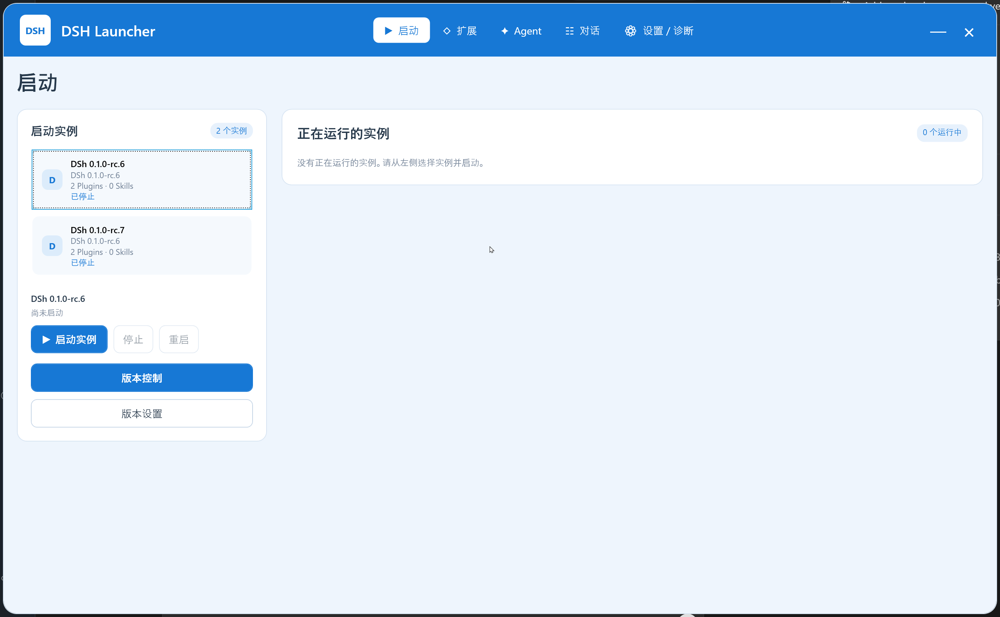
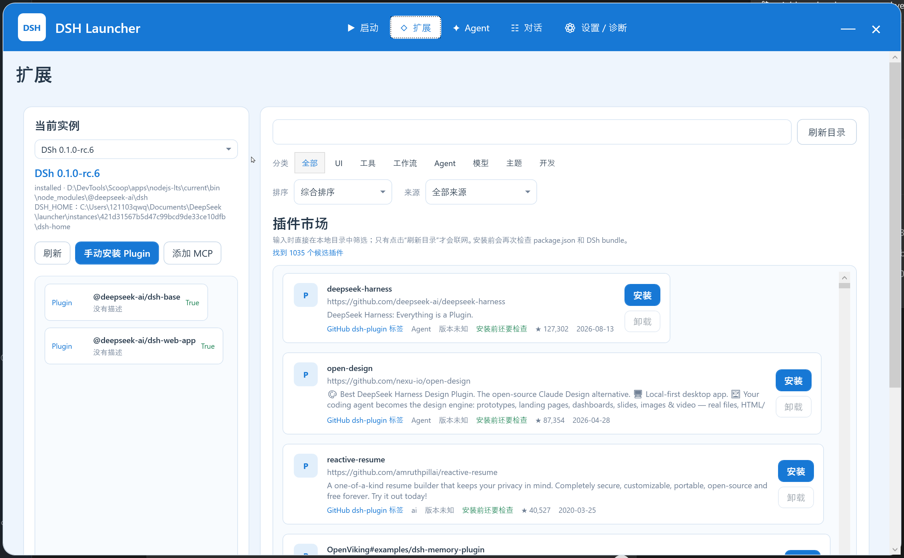
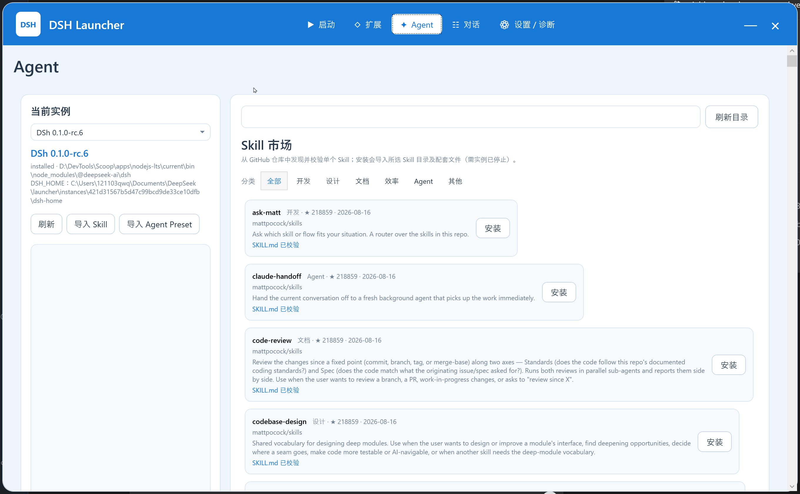
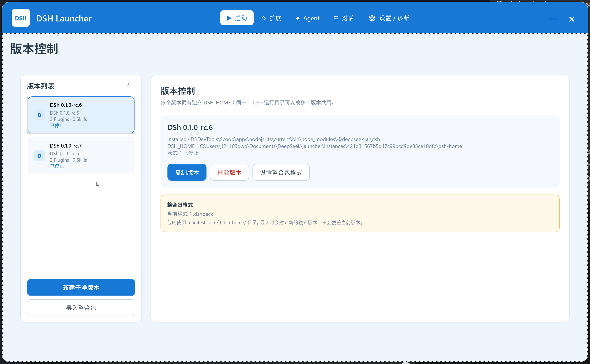
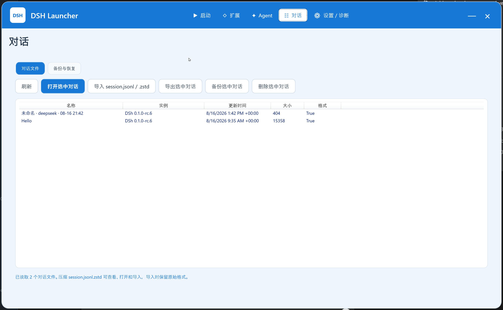

# DSH Launcher

面向 Windows x64 的 [DeepSeek Harness（DSh）](https://github.com/deepseek-ai/deepseek-harness) 图形化启动器与生态管理器。

DSH Launcher 使用 .NET 8 WPF 开发，负责管理多个 DSh 版本、运行实例、Plugin、Skill、Provider 和对话文件。Launcher 本身可以在没有 Node.js 或 DSh 的环境中打开，并提供运行环境检测与安装引导。



## 界面预览

| Plugin 市场 | Skill 市场 |
| --- | --- |
|  |  |

| 版本控制 | 对话管理 |
| --- | --- |
|  |  |

## 主要功能

### 华丽视觉与流畅切页

- 华丽视觉默认开启；升级至 v1.2.4 时，旧配置也会自动开启一次并保留原配置备份，材质和单项效果选择不变。可在“设置 → 华丽视觉”关闭，后续启动不会强制重开；切换后立即生效并自动保存。
- 可选原始实体、毛玻璃、液态玻璃（轻量），并分别开关流体背景、漂浮粒子、鼠标光晕、拖尾、点击波纹与层次视差。
- 玻璃只作用于 Launcher 内部的装饰背景，不是桌面透明或真实光学折射；正文和输入内容保持清晰。
- 背景可以持续缓慢流动，窗口隐藏或最小化时暂停；关闭华丽视觉不会关闭页面的渐出、渐入动画。
- 顶栏支持窄窗口紧凑布局，导航文字与品牌对齐，入口不因空间不足而消失。
- 按钮与列表项悬停时有轻微抬升和柔和阴影；分类、焦点框、提示框及滚动条采用统一圆角样式。基础悬停反馈不需要开启华丽视觉。

### 多版本与多实例

- 新建和复制的版本使用独立的 `DSH_HOME` 与 `DSH_AGENTS_HOME`；也可直接关联其他桌面端已有的 `DSH_HOME`。
- 支持复制现有版本、新建干净版本、删除版本和修改版本名称。
- 支持 Launcher `.dshpack` 与 DSH-PackForge ModPack v2 `.tgz` 的导入、导出和双向转换；目录式 Skill 的常见文本脚本会随包保留并脱敏，密钥、dotenv 和会话不会进入分享包，导入时创建新版本且不覆盖已有版本，并通过官方 DSh Plugin CLI 恢复 Profile 依赖。
- 在“下载 → 整合包”中搜索 [DSH-PackForge 社区市场](https://dsh-packforge.github.io/dsh-pack-market/) 的整合包，按大小和 SHA-256 校验下载内容，预览后安装到新版本。缺少校验信息的条目不可安装；支持取消，依赖恢复失败时保留已导入的版本。第三方插件可能执行代码，请只安装可信内容。暂不提供一键上传。
- 可从市场或本地导入 `.dspack` Profile 包（容器 v2/v3，manifest v4；v3 也接受 manifest v5），映射到隔离版本的 `profiles/web`，直接依赖按清单固定版本或 commit。暂不支持 `dshhome` 整机包、非空 `files[]` 外部资源或无法确定 Git 插件包名的包，这些情况会明确拒绝，不生成不完整版本；也不自动替换当前 DSh Runtime。原有两种格式的导出和转换保持不变。
- 同一个 DSh 运行目录可供多个隔离版本使用，并可同时启动多个实例。
- 每个版本可把“打开窗口”绑定到 DSH Desktop，或本机的 EXE、BAT/CMD、PowerShell 脚本和 LNK 快捷方式；仍可随时改用 Launcher 启动。
- 区分 Launcher 自己启动的 **Managed** 实例与连接外部服务的 **Attached** 实例；Attached 实例不会被停止或重启操作误杀。

### 运行环境

- 检测 Node.js 的 Missing / Compatible / Incompatible / Unknown 状态。
- DSh 只有在命令可执行、官方安装包可解析且两边版本一致时才视为可用；残留命令或损坏安装会进入修复引导。
- 根据当前 DSh 的 `package.json` / `engines.node` 判断 Node.js 兼容性，不长期硬编码版本要求。
- 新建版本从官方 npm metadata 读取可用 DSh 版本，支持 `rc.11` 等两位数 RC；启动参数会按旧版与当前版本能力选择。
- 没有版本时提供首次运行引导，可选择官方源或国内镜像，并设置 DSh 安装位置。
- 支持 installed DSh 与 Source 项目。
- Launcher 不内置 Node.js、npm、pnpm 或 DeepSeek Harness；自包含发布包约 65 MiB，包含 .NET、WPF、WebView2 和压缩依赖，不要求预装 .NET。框架语言资源保留英语及简繁中文，其余框架提示回退到英语。
- 顶栏“下载”把 Launcher 更新与官方 DSh 版本选择集中到一个页面；选择 DSh 后进入独立版本创建流程。

### Launcher 更新与回退

- 启动后在后台检查 GitHub 稳定版 Release；发现新版本时由用户决定是否下载，不会静默更新。
- “设置 / 诊断”可刷新版本目录，选择较新版本更新，也可选择历史稳定版回退。
- 只下载本仓库 Release 中固定命名的 `DSH.Launcher.exe`，并校验附件大小、文件版本和 GitHub SHA-256 后才替换。
- 替换过程不请求管理员权限，也不会改动实例、`DSH_HOME` 或配置快照；Launcher 所在目录需要当前用户可写。

### Plugin 与 Skill 市场

- Plugin 市场聚合社区目录、GitHub `dsh-plugin` 标签和用户自定义目录。
- 缓存优先打开，搜索、分类、来源和排序在本地完成；只有刷新目录时才联网。
- GitHub 请求使用 ETag / Last-Modified 条件缓存；设置页显示剩余配额和限流恢复时间，并可选保存当前 Windows 用户 DPAPI 加密的 Token，Token 不会回显或进入分享包。
- 安装前检查 `package.json`、`dsh.bundle.patch` 和实际安装来源，最后调用官方 DSh Plugin CLI。
- Plugin 安装目标只来自市场目录和已验证的包元数据，不读取 README 改写安装命令。
- 默认使用快速安装；快速模式失败时可直接用兼容模式重试，也可在设置中把兼容模式设为默认。
- 安装、更新、卸载显示 pnpm 实际解析、复用、下载和添加数量；Skill 下载显示真实字节进度，完成后自动刷新当前实例状态。
- Plugin CLI 会继承当前环境或 Git 全局代理，避免 Launcher 从资源管理器启动后 GitHub codeload 下载绕过已有代理。
- 默认 Plugin `@deepseek-ai/dsh-base` 与 `@deepseek-ai/dsh-web-app` 只读保护，不能禁用或删除。
- 同一版本存在多个 DSh Profile 时，可在扩展页切换当前 Profile；Plugin 列表、CLI 安装和回档随选择切换。包含 Web App 的 Profile 也可由 Launcher 启动，非 Web Profile 会给出明确提示。
- Chat 主题联动会先探测 DSh 上游 `ui-theme.preference` 能力；不支持、未运行或没有打开 Chat 时按钮保持禁用，不注入私有兼容接口。
- Skill 市场发现并校验仓库中的单个 `SKILL.md`，支持分类、搜索和按 Skill 目录安装。
- 新电脑没有缓存或 GitHub 暂时不可用时先显示内置待校验条目，不再出现整页空白；联网成功后自动替换为最新目录。
- 支持导入本地 Skill 与 Agent Preset，并按当前版本隔离保存。

### Provider、对话与同步

- 独立的全局 Provider 页面汇总全部 Coding 版本和运行中 DSh 的模型目录，不显示具体实例；可以统一设置新对话使用的默认模型。
- Provider 页面在打开期间每 15 秒读取 DSh 官方 `llm.providers` 状态，显示在线、未加载或运行异常；离开页面后停止监控。
- Launcher 配置只保存 API Key 的环境变量名称；真实密钥继续由 DSh 官方 `.credentials.yaml` 管理。
- Provider 自动同步只在双方都开启同步且实例已停止时生效，会原子复制官方凭据文件，但不会解析、显示、记录或打包其中的密钥；没有 llm Provider 配置时不会覆盖文件。
- 导入或同步旧 DSh 数据时，会把历史 `version: 1` / `refs:` 凭据包装转换为当前官方插件接受的平铺格式；只调整结构，不显示密钥内容。
- 管理 `session.jsonl`、`session.vN.jsonl` 及其 `.zstd` 压缩文件（格式 v0–v3）：查看、打开、导入、导出、备份、恢复和文件级删除。同一会话只显示最高代际，保留旧代际供回退；目标 DSh 不支持该格式时明确拒绝导入、同步或打开，未知格式不会静默按旧格式处理。
- 对话列表显示会话名称和所属实例，不直接暴露内部路径 ID。
- 对话模型按“单独对话 → DSh 真实工作目录 → 全局默认”自动继承；从 Launcher 打开会话时通过 DSh 官方 `session.selectModel` 应用。
- 对话可选择版本独立、按工作区同步或全量同步；运行中的版本不会被同步写入。
- 对话页可同时按时间、范围和全文搜索标题、工作区及 JSONL/Zstandard 正文；损坏文件不会中断整批结果。

### 任务、运行与诊断

- 顶栏任务中心集中显示下载、运行环境准备、Plugin 操作和实例导入任务，支持取消、重试及最近 50 条历史。
- Launcher 管理的实例显示整个进程树的 CPU、内存和运行时长；资源数据只保存在内存中。
- 每个版本可独立设置空闲自动停止和崩溃自动重启；默认关闭，自动重启采用有限退避并最多连续尝试 5 次。
- Plugin 安装前读取包声明的 DSh 兼容范围；单项安装允许用户确认后强制尝试，批量更新会跳过明确不兼容项。
- 设置页可查看最近 7 天日志、导出不包含凭据和会话正文的诊断 ZIP，并按实例预览存储分类与安全清理候选。
- 安全清理只把自动快照、Launcher 报告和明确缓存逐文件移入 Windows 回收站，不处理会话、凭据、手动快照或目录。

### CLI、URL 协议与快捷方式

- 设置页可为当前 Windows 用户注册 `dsh-launcher://`，不需要管理员权限；版本设置可创建指定实例的桌面启动快捷方式。
- 命令行支持 `open`、`start`、`stop`、`restart`、`chat`、`version-settings`、`plugins` 和 `conversations`，并把指令转发给已经运行的 Launcher。

```powershell
& '.\DSH.Launcher.exe' start --instance-id '<实例 ID>'
& '.\DSH.Launcher.exe' chat --instance-id '<实例 ID>' --session-id '<会话 ID>'
Start-Process 'dsh-launcher://plugins?instanceId=<实例 ID>'
```

### 独立聊天窗口

- 每个运行实例使用独立 WebView2 Chat 窗口和任务栏图标。
- 关闭 Chat 窗口不会停止 DSh 实例。
- 再次点击启动或双击运行中的实例，可以重新呼出对应 Chat 窗口。

## 快速开始

1. 从 [Releases](https://github.com/121103qwq/DSH-Launcher/releases/latest) 下载最新的 `DSH.Launcher.exe`。
2. 直接运行程序，不需要安装 .NET SDK。
3. 如果本机没有版本，按首次运行引导选择下载源和 DSh 安装位置。
4. 选择或创建版本，点击“启动实例”。

Launcher 启动时不会静默下载或安装内容。Node.js 或 DSh 缺失时，只有在用户确认后才进入准备流程。

## 关联已有桌面端数据

打开 **版本控制 → 关联已有 DSH_HOME** 后，会自动查找当前 `DSH_HOME` 环境变量、默认 `~/.dsh`、已检测桌面端（含可确认的运行中 HOME）和已登记外部目录，也可以刷新或手动选择。选择候选后自动填写目录、Profile 和匹配的已有运行程序，已关联目录不会重复添加。这里选择的是包含 `settings.yaml`、`profiles` 或 `sessions` 等内容的数据目录，不是程序安装目录。没有运行程序时，先从“导入实例”添加已有桌面端或 DSh 程序；无需再下载一份。

关联不会复制、迁移或自动覆盖原配置；插件、模型和对话管理直接使用该目录，手动修改也会影响原桌面端。外部关联不参加 Launcher 的跨版本自动同步或全局默认模型设置。移除时按钮为“解除关联”，保留原目录和备份。复制此版本则会生成独立副本。

Launcher 会在启动或修改外部 HOME 前重新检查受支持的 DSH Desktop / DeepSeek Desktop 进程：发现同一 HOME 被占用时阻止操作；无法确认桌面端 HOME 时也会暂停该操作并说明原因。仍可浏览和解除关联，不会自动关闭桌面端或改用另一个 HOME。该检查不是共同互斥锁，不能覆盖未知第三方桌面端、脱离桌面端的残留子进程，或检查后才从外部启动的进程；使用期间仍请避免两边同时运行。已有非 Web Profile 可以管理，但不能由 Launcher 作为 Web 实例启动；SQLite-only 会话仍由 DSh 自己管理。

## 数据隔离

Launcher 注册信息与各个 DSh 版本的数据分开保存。默认结构如下：

```text
Documents\DeepSeek\launcher\
├─ instances.json
├─ launcher-settings.json
├─ instances\
│  ├─ <version-id>\dsh-home\
│  └─ <version-id>\dsh-home\
└─ backups\
   └─ <version-id>\
```

Plugin、Skill、MCP、Provider、Agent、Settings 和 Conversation 策略都以版本自己的 `DSH_HOME` 为边界。复制版本会复制整套版本数据；新建干净版本只复用 DSh 运行程序，不复用原版本数据。

关联已有 `DSH_HOME` 的版本不使用上图中的隔离 HOME：数据仍在原目录，Launcher 的版本设置单独保存于 `instances/<实例 ID>/version-settings.json`。

版本设置提供两种配置快照：`.dshsnapshot` 使用 Windows DPAPI，适合同一电脑上的快速回滚；`.dshpsnapshot` 使用密码派生密钥和 AES-GCM，适合跨电脑迁移。两种快照都不包含对话或运行依赖，跨电脑导入前会先创建本机回滚点。

Launcher 自有的实例注册、全局设置和版本设置带有 schema 版本。旧格式会先备份再原子迁移；较新且无法识别的 schema 不会被改写。

## 从源码构建

需要安装 .NET 8 SDK。在仓库根目录执行：

```powershell
dotnet restore .\src\DshLauncher\DshLauncher.csproj --locked-mode
dotnet build .\src\DshLauncher\DshLauncher.csproj -c Release -r win-x64 --no-restore
```

生成 Windows x64 自包含单文件：

```powershell
dotnet publish .\src\DshLauncher\DshLauncher.csproj `
  -c Release -r win-x64 --self-contained true `
  -p:PublishSingleFile=true `
  -p:IncludeNativeLibrariesForSelfExtract=true `
  -p:EnableCompressionInSingleFile=true `
  -o ".\DSH Launcher"
```

运行正式单元测试和完整 SelfTest：

```powershell
dotnet restore .\tests\DshLauncher.UnitTests\DshLauncher.UnitTests.csproj --locked-mode
dotnet test .\tests\DshLauncher.UnitTests\DshLauncher.UnitTests.csproj -c Release --no-restore
dotnet restore .\tests\DshLauncher.SelfTest\DshLauncher.SelfTest.csproj --locked-mode
dotnet run --project .\tests\DshLauncher.SelfTest\DshLauncher.SelfTest.csproj -c Release --no-restore
```

仓库的 Windows CI 使用固定 .NET SDK 和 NuGet lock files；`v*` 标签与项目版本一致时，才会生成固定名 `DSH.Launcher.exe`、`version.json` 和 `SHA256SUMS.txt`，并创建草稿 Release 供发布前确认。

发布文件位于 `DSH Launcher\DSH Launcher.exe`。

## 当前版本

当前源码版本为 **v1.2.4**。下载、变更说明和 SHA-256 信息请查看 [GitHub Releases](https://github.com/121103qwq/DSH-Launcher/releases)。

本次更新支持新版 `session.vN.jsonl` 对话文件、社区整合包市场和 `.dspack` Profile 导入，并补充 MIT 许可证。整合包一键上传、`dshhome` 整机包和 `files[]` 外部资源暂不支持。

## 许可证

DSH Launcher 自有代码采用 [MIT License](LICENSE)。允许商用、修改和再分发，但须保留版权与许可声明。第三方依赖、DSh Runtime 和社区整合包仍遵循各自的许可证。
